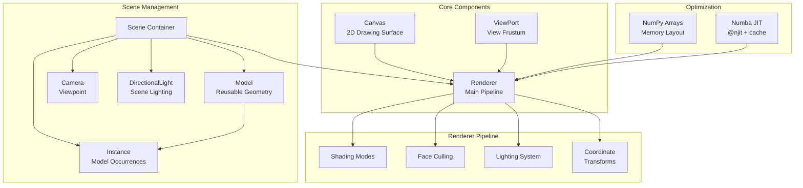

# Pixerise Architecture Diagram

```mermaid
graph TD
    subgraph Scene Management
        Scene[Scene Container]
        Model[Model<br/>Reusable Geometry]
        Instance[Instance<br/>Model Occurrences]
        Camera[Camera<br/>Viewpoint]
        Light[DirectionalLight<br/>Scene Lighting]
        
        Scene --> Model
        Scene --> Instance
        Scene --> Camera
        Scene --> Light
        Model --> Instance
    end

    subgraph Core Components
        Canvas[Canvas<br/>2D Drawing Surface]
        ViewPort[ViewPort<br/>View Frustum]
        Renderer[Renderer<br/>Main Pipeline]
        
        Canvas --> Renderer
        ViewPort --> Renderer
    end

    subgraph Renderer Pipeline
        Shading[Shading Modes]
        Culling[Face Culling]
        Lighting[Lighting System]
        Transform[Coordinate<br/>Transforms]
        
        Renderer --> Shading
        Renderer --> Culling
        Renderer --> Lighting
        Renderer --> Transform
    end

    subgraph Optimization
        NumPy[NumPy Arrays<br/>Memory Layout]
        Numba[Numba JIT<br/>@njit + cache]
        
        NumPy --> Renderer
        Numba --> Renderer
    end

    Scene --> Renderer
```
